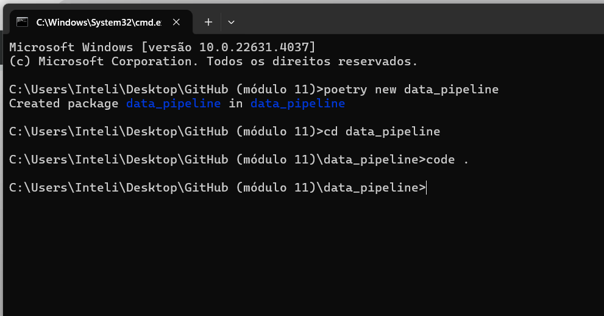

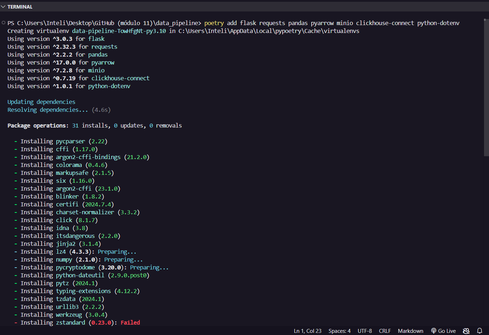

- Tentando contornar o erro acima
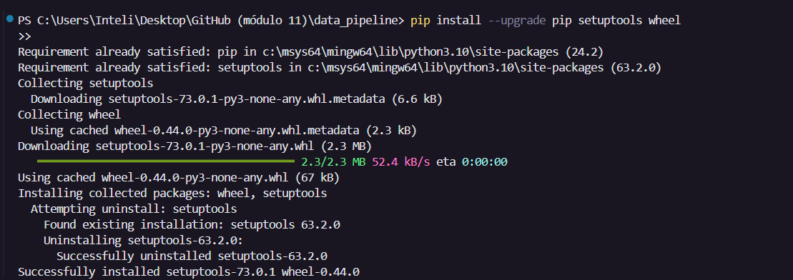
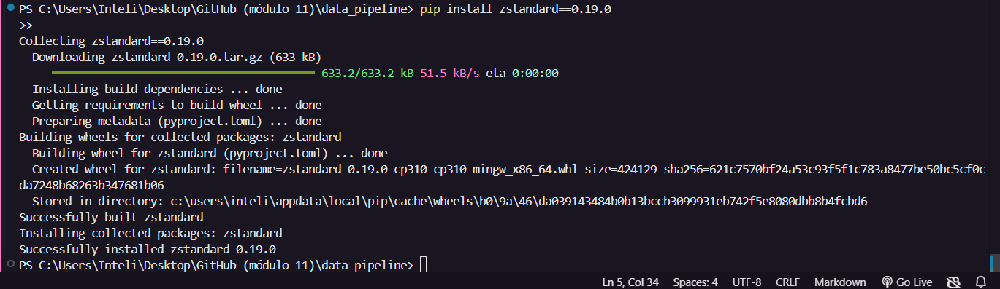

- Criar arquivo docker
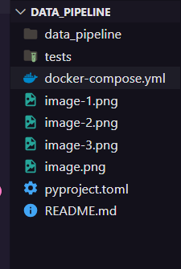
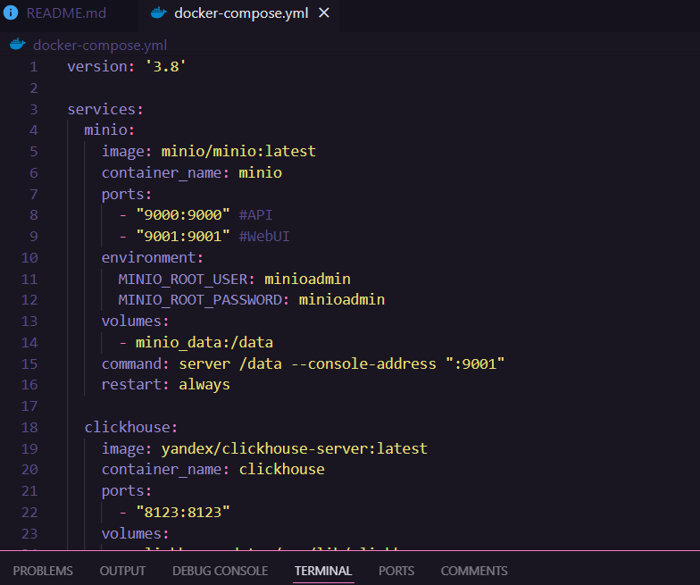

- docker compose up --build
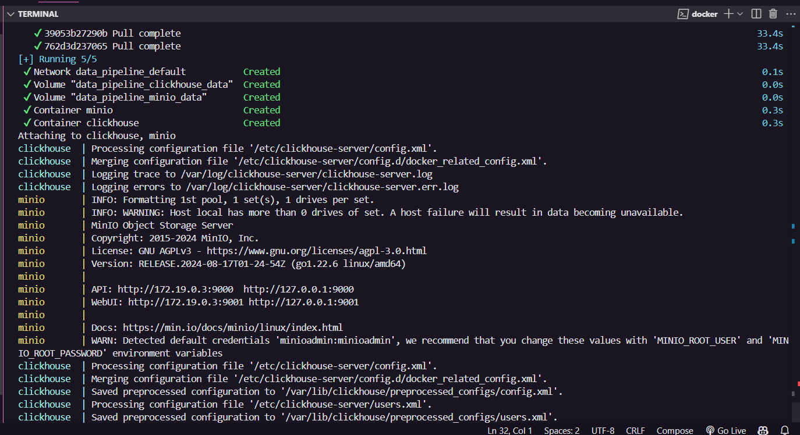

- o docker compose parou nessa última linha e já se vão uns 10 minutos
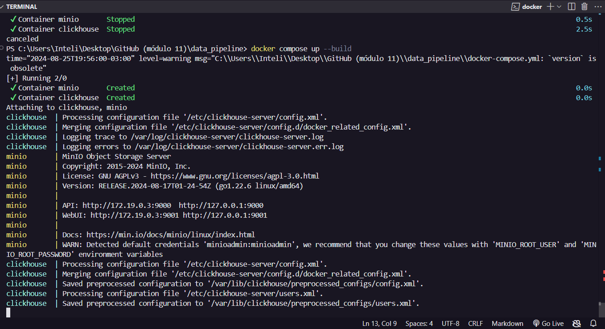

- localhost:9001
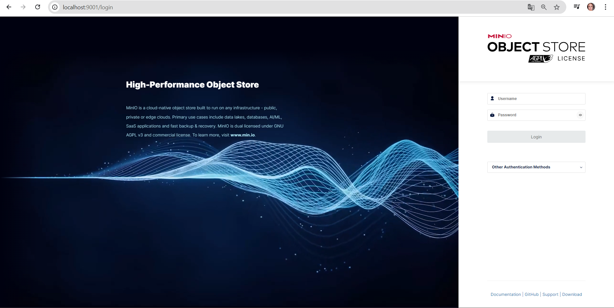
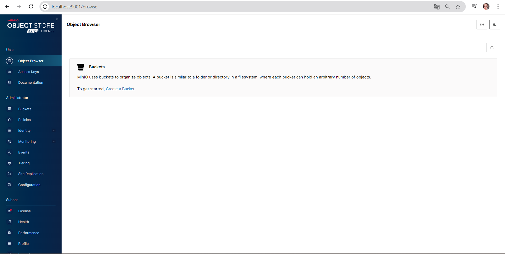

- dbeaver
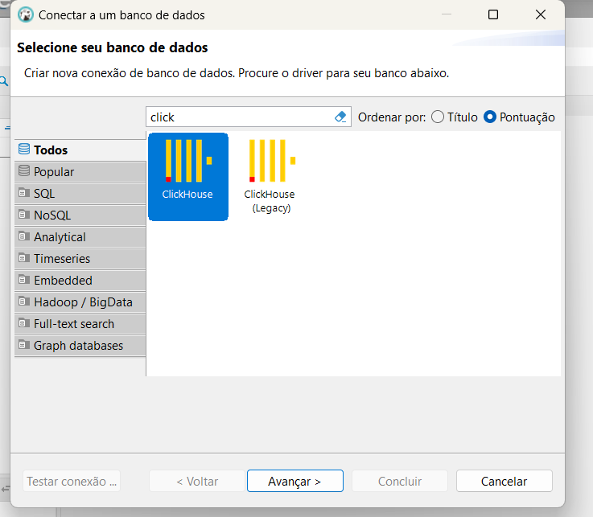

- resolvendo falha na conexão
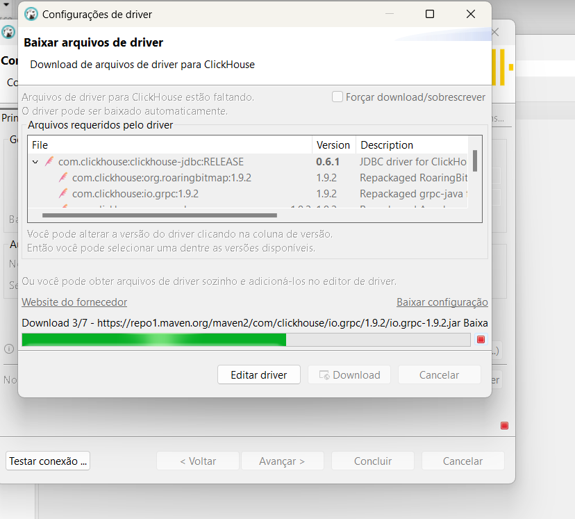
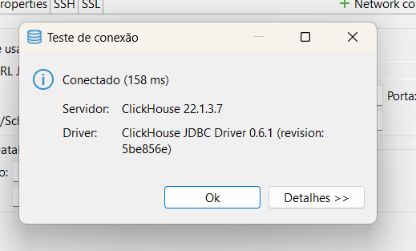

- erro (triste) no minio
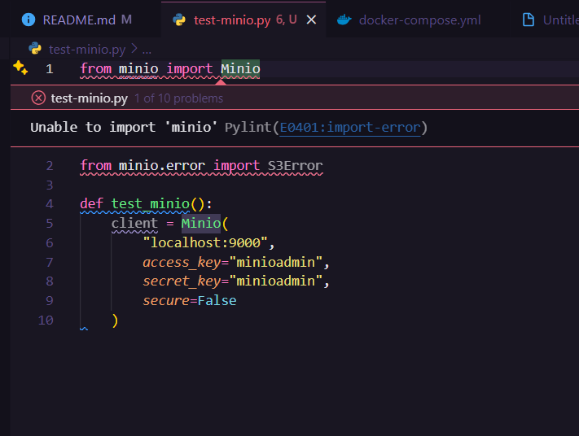
- não estou conseguindo resolver o erro no minio
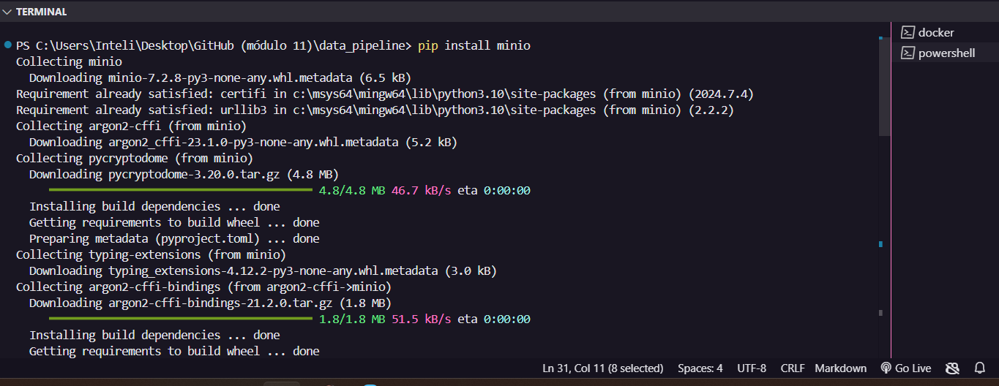

- test-minio.py rodou!!!
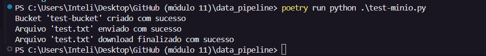
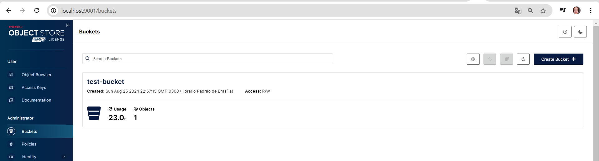

-sql 
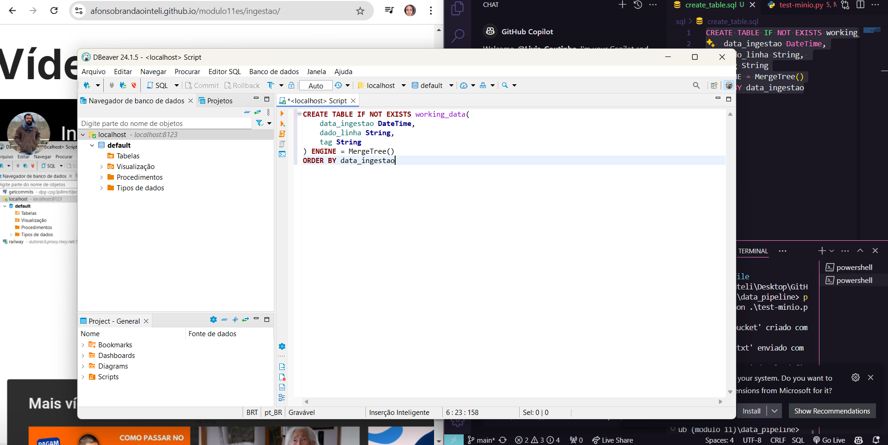

- criação .env
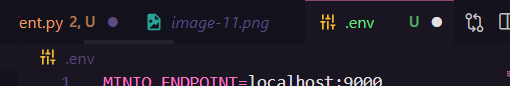

-
-
-

- client clickhouse
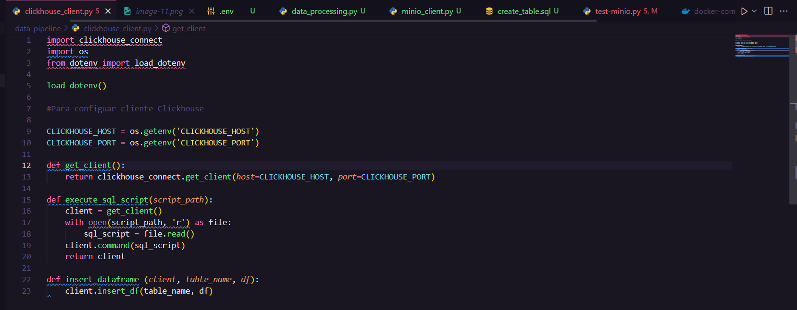

- data processing
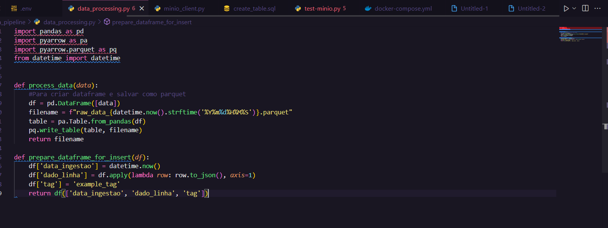

- minio_client
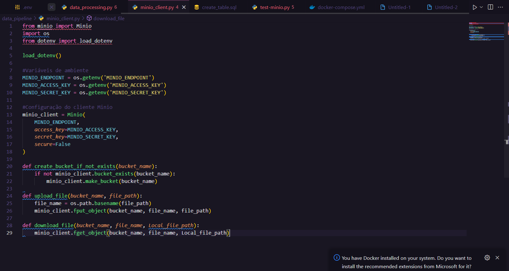

- servidor app.py
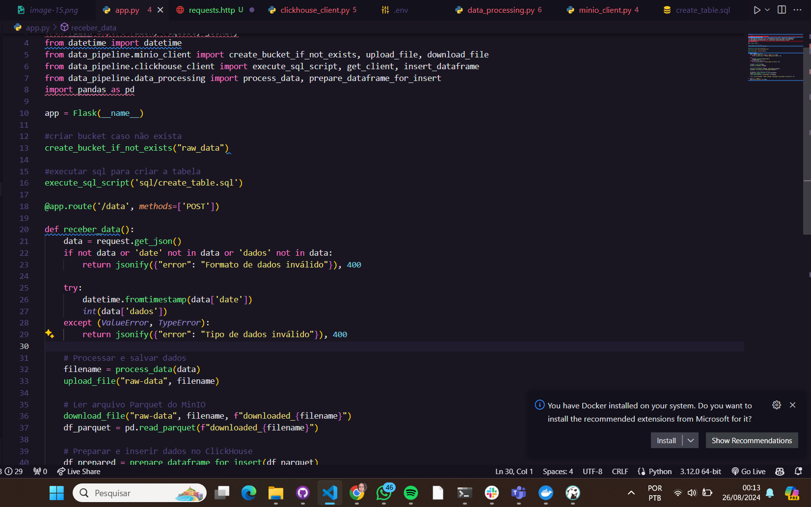

